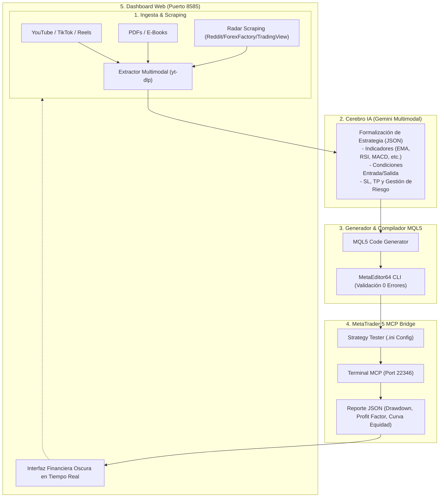

# 🤖 CREADOR MT5 — Trading Strategy Studio

Plataforma integral de Trading Algorítmico asistida por Inteligencia Artificial que procesa videos (YouTube, TikTok, Instagram Reels, Facebook Reels), documentos PDF o enlaces web de estrategias de trading, extrae y formaliza su lógica matemática, genera automáticamente código **Expert Advisor en MQL5** de grado institucional y se conecta al terminal de **MetaTrader 5 mediante MCP (Model Context Protocol)** para compilar, optimizar y ejecutar **backtesting tick a tick** en tiempo real.

Incluye además un motor de **Scraping y Radar Global** para rastrear estrategias virales y rentables en comunidades como Reddit, Forex Factory, TradingView y canales de video.

---

## 🚀 Características Principales

1. **📥 Ingesta Multimodal Universal:**
   - **Videos y Redes Sociales:** Soporta YouTube, TikTok, Instagram Reels y Facebook Reels. Descarga el audio, analiza las explicaciones del trader y extrae las reglas.
   - **Documentos Técnicos:** Carga de libros y manuales en PDF para extracción de setups.
   - **Texto & Prompts:** Creación rápida a partir de descripciones directas.

2. **🌐 Radar & Scraping Global de Estrategias:**
   - Rastreo exhaustivo en YouTube, TikTok, Reddit (`r/algotrading`, `r/Forex`), Forex Factory y TradingView.
   - Botón directo **"⚡ Importar a MQL5"** que descarga el contenido, extrae los indicadores y genera el EA al instante.

3. **🧠 Generador MQL5 Institucional:**
   - Generación de código compilable en MetaTrader 5 sin errores sintácticos.
   - Detección de nueva vela (`IsNewBar()`), manejo de posición institucional con `Trade.mqh`, gestión de slippage y parámetros configurables (`input`).

4. **⚡ Conexión Directa con MetaTrader 5 (MCP Server):**
   - Integración nativa con los endpoints MCP del Terminal (`127.0.0.1:22346`) y MetaEditor.
   - Compilación automatizada y verificación de parámetros con `MetaEditor64.exe`.
   - Control automatizado del **Strategy Tester** (`metatester64.exe`) mediante archivos de configuración `.ini` dinámicos.

5. **📊 Dashboard Interactivo & Auditoría de la IA:**
   - Gráfico de curva de balance y equidad en vivo.
   - Cálculo automático de **Beneficio Neto**, **Profit Factor**, **Max Drawdown %**, **Win Rate %** y **Ratio Sharpe**.
   - Veredicto de la IA sobre la consistencia estadística de la estrategia para evitar sobreoptimización (*curve fitting*).

6. **⚙️ Configurador Dinámico de MCP:**
   - Modal en el dashboard para cambiar en caliente las URLs, puertos y tokens Bearer de tu terminal MT5 sin reiniciar el servidor.

---

## 🏗️ Arquitectura del Sistema



---

## 🛠️ Instalación y Requisitos

### Requisitos Previos:
- **Sistema Operativo:** Windows 10/11 (64-bit).
- **MetaTrader 5:** Instalado con cuenta conectada (Demo o Real) y servidor MCP habilitado.
- **Python:** Python 3.11 o superior.

### Pasos de Instalación:

1. **Clonar el repositorio:**
   ```bash
   git clone https://github.com/enfocadosenfocados-bot/CREADOR-MT5.git
   cd CREADOR-MT5
   ```

2. **Instalar dependencias:**
   ```bash
   pip install -r requirements.txt
   ```

3. **Configurar Conexión MCP:**
   - Copia `config.example.json` a `config.json`:
     ```bash
     copy config.example.json config.json
     ```
   - O bien, abre el dashboard y haz clic en el botón superior **`⚙️ Configurar MCP`** para ingresar tus tokens y URLs de MetaTrader 5 directamente desde la interfaz.

4. **Iniciar la Plataforma:**
   - Haz doble clic en **`start_studio.bat`**, o ejecuta:
     ```bash
     python -m uvicorn server:app --host 127.0.0.1 --port 8585
     ```

5. **Abrir en tu navegador:**
   👉 **http://127.0.0.1:8585**

---

## 📁 Estructura del Proyecto

```
CREADOR-MT5/
├── static/
│   ├── index.html          # Interfaz visual del dashboard financiero
│   └── app.js              # Lógica del cliente, polling de backtests y gráficos
├── config.example.json     # Plantilla de configuración MCP
├── mql5_generator.py       # Motor generador de código MQL5 institucional
├── mt5_mcp_client.py       # Cliente JSON-RPC MCP para MetaTrader 5 Terminal y Tester
├── strategy_extractor.py   # Extractor multimodal (Gemini + yt-dlp + pdfplumber)
├── strategy_scraper.py     # Motor de búsqueda y radar en redes y foros
├── server.py               # API Backend FastAPI
├── start_studio.bat        # Lanzador rápido en 1 clic (Windows)
└── requirements.txt        # Dependencias de Python
```

---

## 🛡️ Licencia
Desarrollado para la suite algorítmica de **Enfocados Bot**.
Uso libre bajo Licencia MIT.
